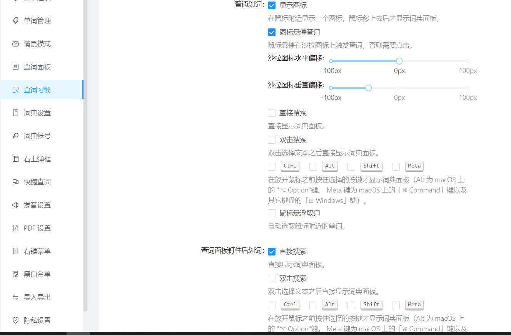
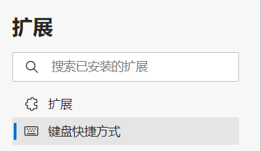
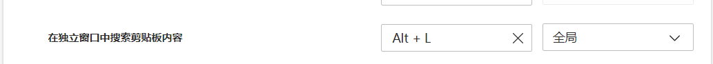
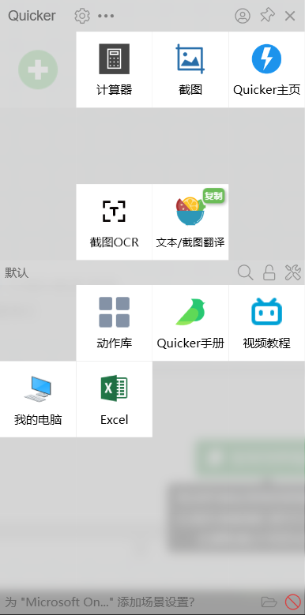
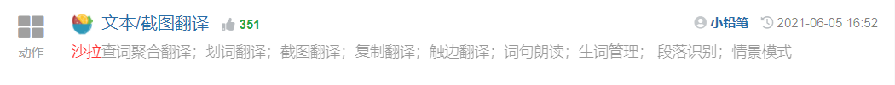
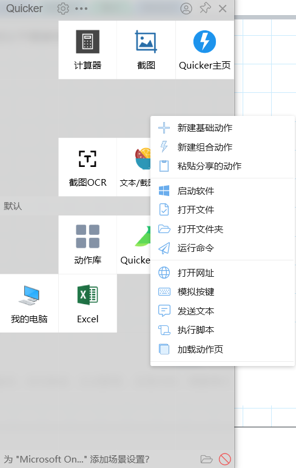
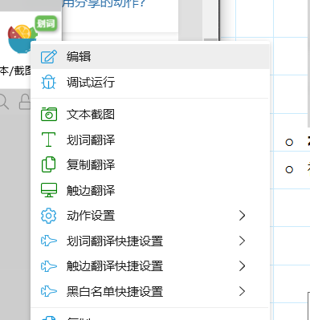
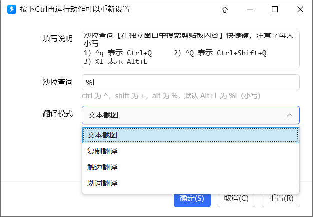
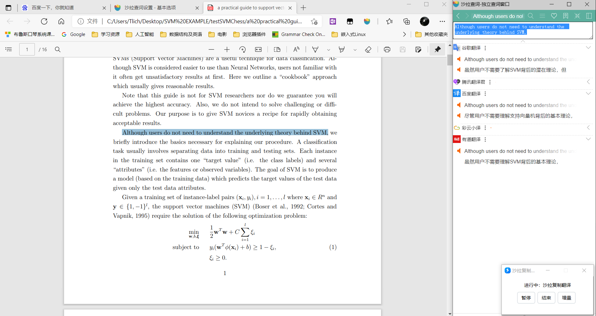

-   主体思路是通过”沙拉查词“+”quicker“实现的

通过两者配合可以实现**复制即翻译**或者**截图翻译**

-   ”沙拉查词是“是edge浏览器上的一个翻译插件，可以实现划词翻译

-   ”quicker“是windows上面一种快捷操作的插件

<!-- -->

-   **安装以及配置沙拉**

    -   通过edge浏览器的应用商店安装插件

-   在”查词习惯“中可以修改怎么样触发查词功能

-   需要在edge浏览器中的"键盘快捷方式"中找到"沙拉查词"的快捷键设置

-   找到之后,在以下条目中设置属于自己的快捷键,这里是ALT+L

如果设置为全局则可以实现在word 等电脑上其他软件上也能实现翻译功能

 

-   **安装即配置quicker**

    -   [技巧分享：Quicker 调用 Saladict 实现全局『文本翻译、截图翻译、复制翻译、触边翻译』 · Discussion #493 · crimx/ext-saladict (github.com)](https://github.com/crimx/ext-saladict/discussions/493)

    -   [Quicker软件 您的指尖工具箱 - Quicker (getquicker.net)](https://getquicker.net/),通过以下链接安装该软件

-   在[分享的动作 - Quicker (getquicker.net)](https://getquicker.net/Share/Actions?exe=common)网址下->查找"沙拉"

-   点击进去,**复制到剪贴板上**

-   之后打开quicker,选择"**粘贴分享的动作**"即可添加完成

-   **右键**也可以选择通过什么方式进行划词

-   初次进入界面会有如下提示,%l为我们之前设置的快捷键

    -   下面会有四种翻译模式

    -   文本截图:通过截图之后通过OCR图像识别之后在进行翻译

    -   复制翻译:通过选中文本"复制"之后即可翻译

    -   触边翻译:选中文本之后,将鼠标移动至边缘即可翻译,可以在高级设置里进行修改

 

-   **实现效果**

